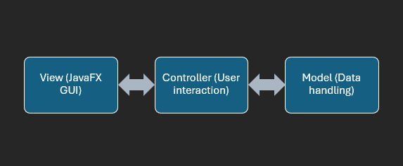
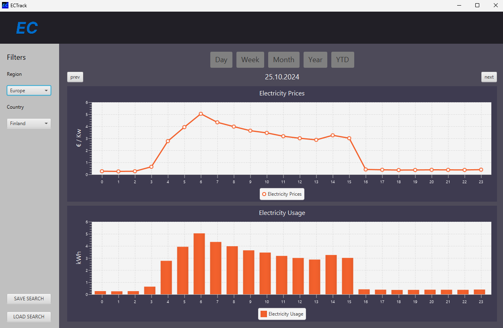

# ECTrack Design Document

## Introduction

ECTrack is a desktop application that visualizes trends in electricity usage and pricing. The goal is to provide users with insights into their electricity consumption, allowing them to track usage patterns and view associated pricing trends. This document outlines the structural components, interfaces, design patterns, and APIs that will be used to build the application.

## System Architecture

### Overview

ECTrack is designed using the Model-View-Controller (MVC) architecture, which separates the data (Model), the presentation (View), and the control logic (Controller). This structure facilitates maintenance, scalability, and flexibility.

#### Key Components:

-   **Model**: Contains the logic for handling and processing electricity consumption data.
-   **View**: Implements the graphical user interface (GUI) using JavaFX to display data to the user.
-   **Controller**: Connects the Model and View, handling user input and updating the View based on data changes in the Model.

### High-Level Diagram

 \
The View sends user inputs to the Controller. The Controller processes the inputs and communicates with the Model. The Model retrieves or updates the data and notifies the View when changes occur.

## Design Patterns

### Model-View-Controller (MVC)

This design pattern is key for separating concerns within the app. By decoupling the user interface from the business logic and data model, it allows us to implement changes independently in each area.

### Singleton Pattern (Tentative)

We are considering the Singleton pattern for handling API requests and ensuring that only one instance of the data-fetching service exists throughout the application.

### Observer Pattern (Tentative)

The View can observe changes in the Model using the Observer pattern. This would allow the GUI to react in real-time to changes in the data.

## APIs and Data Sources

We switched from the intial API choice to the ENTSO-E Transparency Platform API, which provides extensive data on electricity prices and consumption across Europe. This makes it better suited for our purposes. The API alllows us to fetch pricing and usage data for multiple countries and supports various time intervals, enabling ECTrack to provide both realtime and historical insights.
* Pricing data: Day-ahead prices can be fetched hourly, allowing users to view electricity pricing trends in their region of interest.*
* Usage data: Electricity usage data, retrieved at intervals as frequent as every quarter hour, allows users to monitor consumption patterns over time.*
(*There are some kinks with the API requests to straighten out for now.)

### Data Handling

Data is fetched in XML format from the ENTSO-E API, parsed using Java's XML parsing libraries, and stored in the Model. The app allows the user to visulize historical data (e.g., hourly, daily, and weekly views) as well as current trends by region.

## User Interface

### Wireframes

The initial wireframe focuses on simplicity:

-   **Dashboard**: Displays two separate graphs for both electricity usage and electricity pricing.
-   **Controls**: Users can filter data by time (e.g., day, week, month) and region.

#### Prototype Day View

## Future Plans and Considerations

-   **Real-time Data Updates**: Once the initial prototype is completed, we plan to implement real-time data updates.
-   **Authentication**: If we integrate personal smart meters, users will need to authenticate to fetch their data.
-   **Cross-Platform Compatibility**: JavaFX allows for compatibility across platforms, and we will explore packaging options for Windows, macOS, and Linux.
